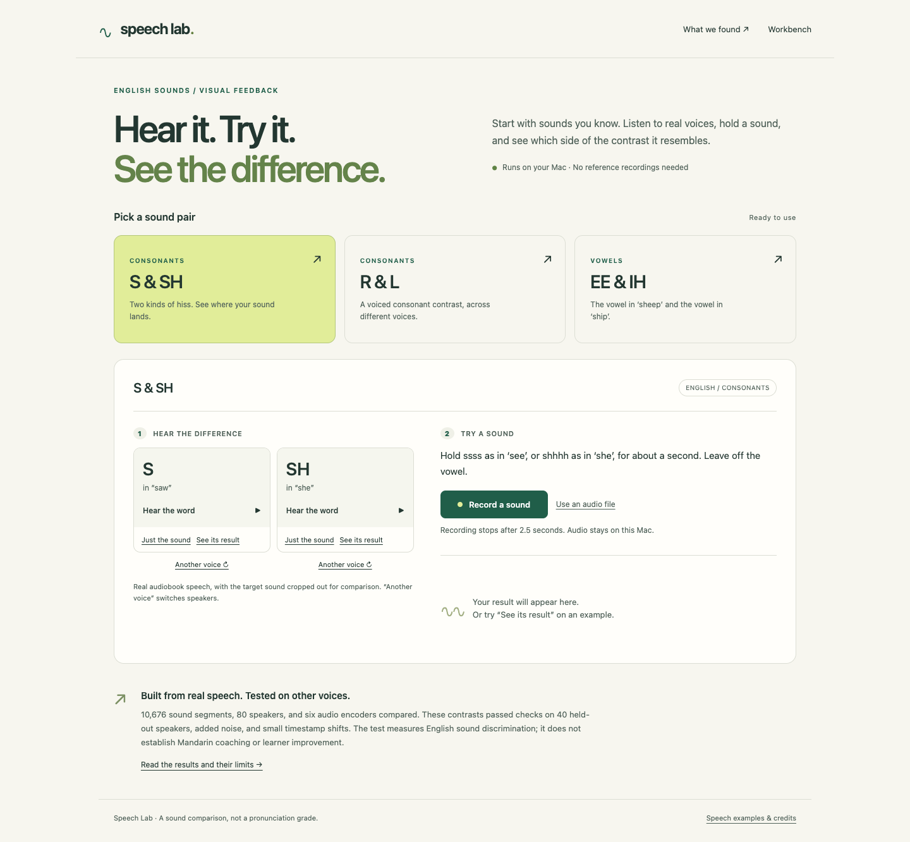

# Speech Lab

A local speech app with **ready-to-use English sound contrasts**, real speech examples, and visual feedback. Listen to different speakers, record one sound, and see which side of the contrast it resembles. No labeling, reference recording, model selection, or training is required.

The demos come from a completed study of **10,676 sound segments from 80 speakers**, comparing acoustic measurements, six frozen audio encoders (including Qwen3-Omni), learned directions, SPARC estimates, and personal reference centroids. Models were selected on validation speakers and tested on 40 separate speakers, with noise and timestamp checks. [Read the measured results](research/RESULTS.md).



The measured result is English sound discrimination. Mandarin transfer, learner improvement, and anatomical coaching have not been established. The marker is a position on a learned contrast, not a percent-correct score.

The three guided contrasts scored **97.6% S/SH**, **99.1% R/L**, and **92.3% sheep/ship vowels** on the final test (balanced accuracy). Learned encoder directions outperformed the simple acoustic baselines for these contrasts. Qwen3-Omni supplies R/L and the vowel demo; Qwen3-ASR 1.7B supplies S/SH. Raw similarity and two-example personal centroids were weaker. Speaker matching helped in an exploratory equal-size comparison, but that does not establish adaptation without correct personal examples.

## Run on a Mac

```sh
./setup.sh
./start.sh
```

Open **http://127.0.0.1:8767**. Stop with Control-C. On the original Mac, the environment has already been installed.

Setup uses `uv` and an isolated Python 3.12 environment, downloading them when needed. Browser recordings and formats such as WebM/M4A need **ffmpeg** (`brew install ffmpeg` if missing); WAV import works without it. Chrome is the tested browser. No Node build step, API key, or rented GPU is needed for the local experiments.

Models use Apple's MPS GPU when available, then CUDA or CPU. One encoder stays loaded at a time. First use downloads weights; the original Mac already has all encoders cached. Allow several GB for dependencies and models. Set `SPEECHLAB_DEVICE=cpu` to force CPU. Corpus data and research dependencies are not needed to use the fitted demos.

## Use the demos

1. Choose a sound pair on the homepage. Play the real word or its isolated sound; **Another voice** switches speakers.
2. **See its result** analyzes the supplied sound immediately, without using your microphone.
3. **Record a sound** captures 2.5 seconds. Follow the prompt and hold only the sound, not the whole word. Recording and analysis stay local.
4. The marker summarizes seven short slices. Try the other English sound and watch it change. Quiet, clipped, short, or inconsistent attempts get a retry message. For S/SH, a frequency measurement also describes where the hiss concentrates.

**What we found** opens the completed results, comparisons, limitations, and timestamped source examples. Natural word sounds were used for the corpus benchmark; sustained microphone practice is a different domain and has not been evaluated in learners. Basic input checks are not a general mispronunciation detector.

## Original workbench

The previous eight experiments remain at **http://127.0.0.1:8767/workbench.html**, sharing the existing local recording library. They are optional research tools; the homepage does not ask you to run them.

| # | Demo | What you can try | Code |
|---|---|---|---|
| 01 | Acoustic microscope | Spectrogram, F1/F2/F3, pitch, frication spectrum, manual timing/VOT landmarks | [acoustics.py](demos/acoustics.py) |
| 02 | Speech embeddings | WavLM Base+/Large and multilingual XLS-R; layers, PCA, cosine distances | [embeddings.py](demos/embeddings.py) |
| 03 | Omni audio encoder | Qwen3-Omni audio tower, plus Qwen3-ASR 0.6B/1.7B audio towers | [models.py](speechlab/models.py) |
| 04 | Learn a direction | Fit a labeled contrast; validate with whole sessions or speakers held out | [directions.py](demos/directions.py) |
| 05 | Articulation explorer | SPARC's WavLM-to-articulation projection; six estimated articulator paths | [articulation.py](demos/articulation.py) |
| 06 | Personal calibration | Compare an attempt with population references and your accepted examples | [calibration.py](demos/calibration.py) |
| 07 | Assessor comparison | Optional Azure, SpeechSuper, and Qwen audio-language-model responses | [providers.py](demos/providers.py) |
| 08 | Feedback practice | Re-record along a fitted contrast; hide feedback for retention attempts | [app.js](speechlab/static/app.js), [directions.py](demos/directions.py) |

The Qwen embedding demo loads **only audio-encoder tensors** into a model, without instantiating the language model. It does not transcribe or generate judgments. Some checkpoint files contain unrelated weights, so download size exceeds the encoder's memory footprint.

See the [original experiment guide](docs/experiments.md), [model notes](docs/models.md), and [validation record](docs/validation.md). Synthetic workbench fixtures are generated harmonic signals filtered into vowel shapes; they are software checks, not human or Mandarin reference speech. The guided demos use actual LibriSpeech recordings.

## Optional cloud providers

Copy `.env.example` to `.env`, fill in the services you want, and restart. Keys stay on the server. The UI requires a sharing checkbox for each send; only the selected audio region is sent. Provider charges and data policies apply. All other experiments work without these services.

- **Azure:** Speech resource key and region; requests phoneme-level pronunciation assessment.
- **SpeechSuper:** app/secret keys and the Mandarin core type enabled for your account. Default: `cn.word.score`. Keep this as a standalone assessment: [its terms](https://speechsuper.com/terms.html) restrict using outputs to train, test, or evaluate another speech engine. Provider results never feed the learned directions.
- **Qwen:** API key, full chat-completions endpoint for your workspace/region, and an audio-input model. `.env.example` suggests `qwen3.8-omni-flash`; verify availability in your account. This streamed textual opinion is separate from the local encoder demo.

Live paid API calls were not performed during setup. [Provider references](docs/models.md#cloud-interfaces) document the interfaces.

## Data and development

Personal audio, labels, features, fitted axes, and results stay in ignored `data/`. Model/download caches use ignored `.cache/`. Public CC BY speech crops and our fitted demo coefficients live in `speechlab/guided_assets/`; [per-clip attribution](speechlab/guided_assets/attribution.json) records their sources and timestamps. Aggregate research results are committed; full corpora and feature caches are excluded. **Export session** in the workbench downloads local labels and results without audio. Back up `data/` for a complete session.

```sh
.venv/bin/python -m speechlab seed
.venv/bin/pytest -q
.venv/bin/ruff check speechlab demos tests scripts research
.venv/bin/python -m speechlab benchmark --articulation
.venv/bin/python -m speechlab benchmark --models qwen-asr-large
# With the server running and Chrome installed:
.venv/bin/python scripts/smoke_ui.py
# Guided UI, with a separate test server (see the script header):
.venv/bin/python scripts/check_guided.py
```

The original browser smoke test uses generated audio through Chrome's fake microphone. The guided UI test loops a public corpus sound through that microphone. Run them against an isolated `SPEECHLAB_DATA` directory so software-test captures stay out of the personal recording library. They never need a real microphone or cloud key. [Research reproduction](research/README.md) is optional; the demos already include fitted probes.

API docs: http://127.0.0.1:8767/docs. Plain HTML/CSS/JavaScript frontend, FastAPI backend, one small module per experiment with shared infrastructure under `speechlab/`. Dependencies are locked in `uv.lock`. The server binds to loopback and rejects cross-origin writes.

The visual/textual feedback is worth investigating with deaf and hard-of-hearing users. This project has not established accessibility outcomes or speech rehabilitation effectiveness. Real microphone quality and learner outcomes need separate testing.

Own code: [MIT](LICENSE). Dependencies and model weights retain their [upstream licenses](THIRD_PARTY.md).
