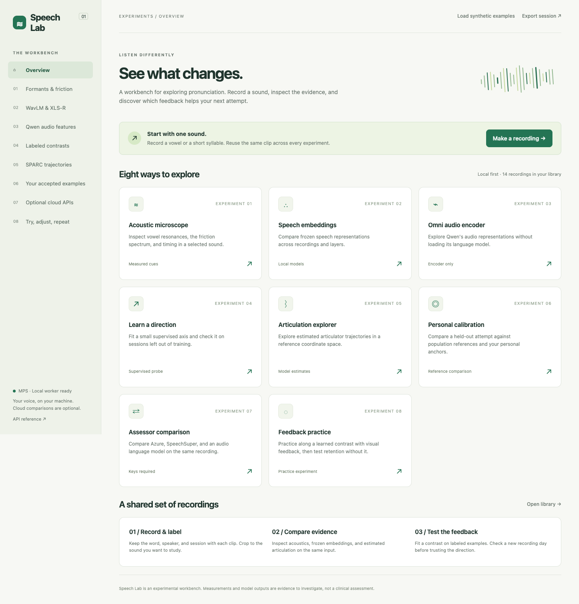

# Speech Lab

A local pronunciation workbench for investigating **consonants, vowels, and feedback that adapts to your voice**. Eight experiments share one recording library and a browser interface. Built with Mandarin practice in mind; recordings and learned contrasts can use any language.

This is experimental software. An embedding distance is not pronunciation accuracy, and an estimated articulator trace does not measure your tongue. The interesting test is whether these displays help you make useful changes that persist without feedback.



## Run on a Mac

```sh
./setup.sh
./start.sh
```

Open **http://127.0.0.1:8765**. Stop with Control-C. On the original Mac, the environment has already been installed.

Setup uses `uv` and an isolated Python 3.12 environment, downloading them when needed. Browser recordings and formats such as WebM/M4A need **ffmpeg** (`brew install ffmpeg` if missing); WAV import works without it. Chrome is the tested browser. No Node build step, API key, or rented GPU is needed for the local experiments.

Models use Apple's MPS GPU when available, then CUDA or CPU. One encoder stays loaded at a time. First use downloads weights; later extraction is cached. Allow several GB for dependencies and models. Set `SPEECHLAB_DEVICE=cpu` to force CPU.

## Eight experiments

| # | Demo | What you can try | Code |
|---|---|---|---|
| 01 | Acoustic microscope | Spectrogram, F1/F2/F3, pitch, frication spectrum, manual timing/VOT landmarks | [acoustics.py](demos/acoustics.py) |
| 02 | Speech embeddings | WavLM Base+/Large and multilingual XLS-R; layers, PCA, cosine distances | [embeddings.py](demos/embeddings.py) |
| 03 | Omni audio encoder | Qwen3-Omni audio tower, plus Qwen3-ASR 0.6B/1.7B audio towers | [models.py](speechlab/models.py) |
| 04 | Learn a direction | Fit a labeled contrast; validate with whole sessions or speakers held out | [directions.py](demos/directions.py) |
| 05 | Articulation explorer | SPARC's WavLM-to-articulation projection; six estimated articulator paths | [articulation.py](demos/articulation.py) |
| 06 | Personal calibration | Compare an attempt with population references and your accepted examples | [calibration.py](demos/calibration.py) |
| 07 | Assessor comparison | Optional Azure, SpeechSuper, and Qwen audio-language-model responses | [providers.py](demos/providers.py) |
| 08 | Feedback practice | Re-record along a fitted contrast; hide feedback for retention attempts | [app.js](speechlab/static/app.js), [directions.py](demos/directions.py) |

The Qwen embedding demo loads **only audio-encoder tensors** into a model, without instantiating the language model. It does not transcribe or generate judgments. Some checkpoint files contain unrelated weights, so download size exceeds the encoder's memory footprint.

## A first session

1. Click **Load synthetic examples** to check the displays immediately. These are generated vowels, not Mandarin reference pronunciations.
2. Open **Acoustic microscope**, record a vowel or import a word, and label its target, speaker, and session. Clips are limited to 30 seconds.
3. Crop to a steady vowel for formants, a frication region for spectral moments, or the release-to-vowel transition for timing.
4. Record several versions of one contrast with comparable syllable context, microphone, and room. Use different session labels on different recording days.
5. Compare representations, then fit a direction using at least three distinct recordings per endpoint. **Any encoder**, including Qwen, can feed the direction-fitting demo.
6. Make new attempts in **Feedback practice**, then try hidden-feedback attempts. Check improvement against independent human judgments.

See the [experiment guide](docs/experiments.md), [model notes](docs/models.md), and [validation record](docs/validation.md).

## Optional cloud providers

Copy `.env.example` to `.env`, fill in the services you want, and restart. Keys stay on the server. The UI requires a sharing checkbox for each send; only the selected audio region is sent. Provider charges and data policies apply. All other experiments work without these services.

- **Azure:** Speech resource key and region; requests phoneme-level pronunciation assessment.
- **SpeechSuper:** app/secret keys and the Mandarin core type enabled for your account. Default: `cn.word.score`. Keep this as a standalone assessment: [its terms](https://speechsuper.com/terms.html) restrict using outputs to train, test, or evaluate another speech engine. Provider results never feed the learned directions.
- **Qwen:** API key, full chat-completions endpoint for your workspace/region, and an audio-input model. `.env.example` suggests `qwen3.8-omni-flash`; verify availability in your account. This streamed textual opinion is separate from the local encoder demo.

Live paid API calls were not performed during setup. [Provider references](docs/models.md#cloud-interfaces) document the interfaces.

## Data and development

Audio, labels, features, fitted axes, and results stay in `data/`. Model/download caches use `.cache/`. Both directories, virtual environments, audio files, and `.env` are ignored by Git. **Export session** downloads labels and numerical results as JSON, without bundling audio. Back up `data/` for a complete session. Exports include speech-derived information.

```sh
.venv/bin/python -m speechlab seed
.venv/bin/pytest -q
.venv/bin/ruff check speechlab demos tests scripts
.venv/bin/python -m speechlab benchmark --articulation
.venv/bin/python -m speechlab benchmark --models qwen-asr-large
# With the server running and Chrome installed:
.venv/bin/python scripts/smoke_ui.py
```

The browser smoke test uses generated audio through Chrome's fake microphone and adds clearly named test recordings/results to the running server. It never needs a real microphone or cloud key.

API docs: http://127.0.0.1:8765/docs. Plain HTML/CSS/JavaScript frontend, FastAPI backend, one small module per experiment with shared infrastructure under `speechlab/`. Dependencies are locked in `uv.lock`. The server binds to loopback and rejects cross-origin writes.

The visual/textual feedback is worth investigating with deaf and hard-of-hearing users. This project has not established accessibility outcomes or speech rehabilitation effectiveness. Real microphone quality and learner outcomes need separate testing.

Own code: [MIT](LICENSE). Dependencies and model weights retain their [upstream licenses](THIRD_PARTY.md).
